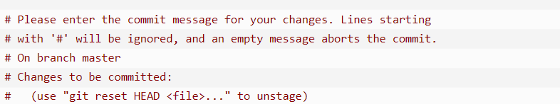

# Basic Usage about GitHub and GitPa

## git clone +the repository or[url]
  you can clone the repository on the Github through the ssh or http . the commad should be  
## git add <file>
this command can load the file to cache(buffer memory)  for example
and git add.  to add all the file in the workstation(current directory)g

## git status 
to check the status of git ,and -s to check the current status of the current directory for short

## git diff 
to show the difference bewteen the thing changed but not writting into cache and changed thing already in cache 
and --stat for short ,command like git diff ,git diff --cached ,git diff HEAD to show all information 

## git commit 
all the thing you that after the git add should store into cache, when you run the command git commit that to add the content of the cache into repository.
and all the commit record your name and your email, so you'd better to initial the information ,usa the command 
(eg :git config --global user.name 'Deniffer'  git config --global  usr.email  liuwenqing1118@qq.com)
and then we can the -m to add the message we want to comment this commit.
(eg: git commit -m "learn git usage first commit")
### important tips: if you don't use -m for specific details that you make in this commit ,and the git would automatically  open the editor for you to sumbit the message ,open vim by default. and the screen would like

  
if you don't like the way that git add first then git commit,you can use -a for skipping the unnessary step,but we recommand the fresh to use the former way.

## git reset HEAD <file>
to cancel the content in cache.

## git rm <file>
if simply delete the file through work directory,it would be have warning that "Changes not staged for commit"
,if you want to remove file in Git, you need to remove through the cached list.
if you make changes in file and run git commit , you should use -f  to force delete the file 
if you want file remove from cache area,and hope to save in current work directory, use --cached instead

## git mv <file>
to remove the file 

## git push 
push the content of cache into internet repository 
format command git push <Remote host> <local brach> <remote brach>